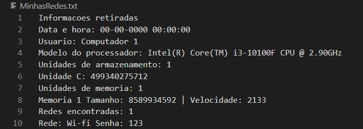

# Subprocess-Python

Bem-vindo ao Projeto de Subprocess com Python! 

Neste arquivo README, você encontrará informações úteis sobre o funcionamento do projeto.

## Índice

- [Sobre](#sobre)
- [Tecnologias e Frameworks](#tecnologias-e-frameworks)
- [Em funcionamento](#em-funcionamento)
- [Conclusão](#conclusão)

## Sobre

O projeto consiste em uma automação para coletar informações do sistema operacional utilizando a biblioteca Subprocess com Python. 

O objetivo principal é extrair dados relevantes sobre o sistema, como informações do hardware, do sistema de arquivos, dos processos em execução, entre outros.

A biblioteca subprocess permite executar comandos do sistema operacional a partir de um programa Python. Ela fornece uma interface para criar processos, redirecionar a entrada/saída padrão, comunicar-se com os processos em execução e obter os resultados de suas saídas, utilizando comandos do CMD.

## Tecnologias e Frameworks 

Neste projeto, foi utilizado as seguintes tecnologias:

- Python

## Em funcionamento

1. Clone este repositório: `git clone https://github.com/M-LaScala/Subprocess-Python`
2. Selecione a IDE de sua preferência para executar o código.

Após a execução do código, o mesmo irá gerar um arquivo de texto com o nome "MinhasRedes.txt" no diretório do projeto.

Este arquivo será preenchido com as seguintes informações:
- Usuário
- Processador
- Unidades de armazenamento
- Unidades de memória
- Rede

Conforme o exemplo:

  
## Conclusão

Este projeto teve início no ano de 2022, com o objetivo de ser um estudo prático sobre a criação de automações utilizando Python. O foco principal é explorar e compreender os conceitos e práticas relacionados à utilização da biblioteca Subprocess para interação com o prompt de comando CMD.

